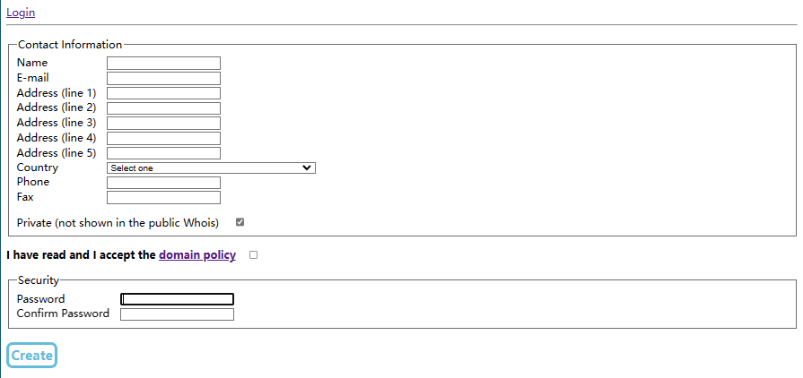
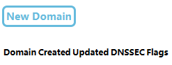
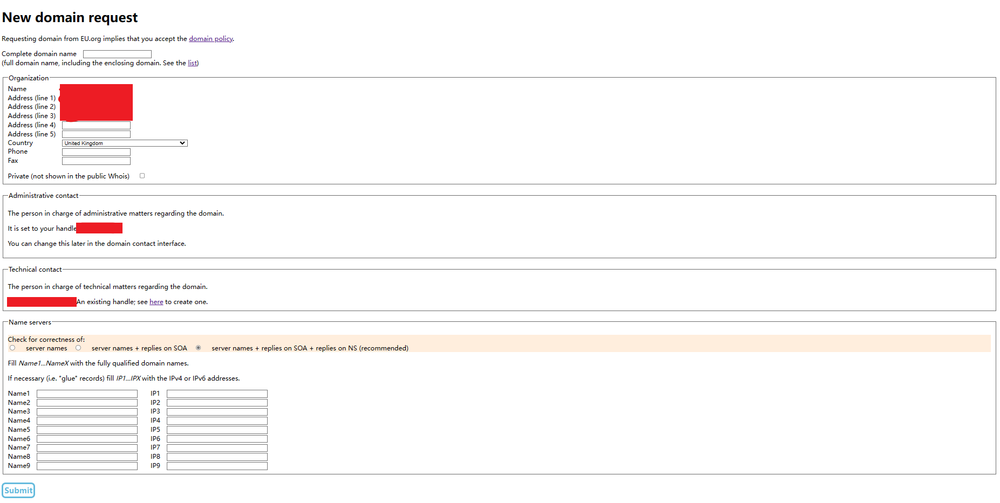

## 前言
    
我在 2023 年 2 月 13 日时域名审核通过了    
不过 eu.org 域名的审核时间长! 不过 eu.org 域名的审核时间长! 不过 eu.org 域名的审核时间长! (重要的事情说三遍! )    
接下来讲一下注册流程
## 注册
首先我们要注册一个 eu.org 域名网站的账号 [网址]( https://nic.eu.org/arf/en/contact/create/ )  找一个英国人信息生成网站 name，Address (line 1) 填生成的, E-mail 填你自己的邮箱 在Country下拉找到 United Kingdom 最后将 I have read and I accept the domain policy 打勾再在 Password 和 Confirm Password 输入你的密码然后到你刚刚输入的邮箱会有一封邮件你先点一下开头的网址，跳转后再点击一个按钮就可以注册了    
## 登录
只要记一下 nic-hdl: 后面的字符然后在 [网址]( https://nic.eu.org/arf/en/login/ ) 登录, Handle为你刚刚记下的字符串 Password填入你的密码 登录之后: 
## 注册网址
点击 New Domain 按钮, 然后跳转到  这个页面, 在 Complete domain name 输入你想要的域名, 比如我想要 x3fang 这个域名那么我就要输入 x3fang.eu.org    
然后最下面选 server name    由于我选的是腾讯云解析所以 Name1 和 Name2 我填入 karate.dnspod.net 与 nice.dnspod.net (适用于 github page 部署和腾讯云服务器部署)    
最后点 Submit 随后如果跳转的页面有 Done 字样代表成功, 否则要按 F5 刷新 审核时间一般为一个月